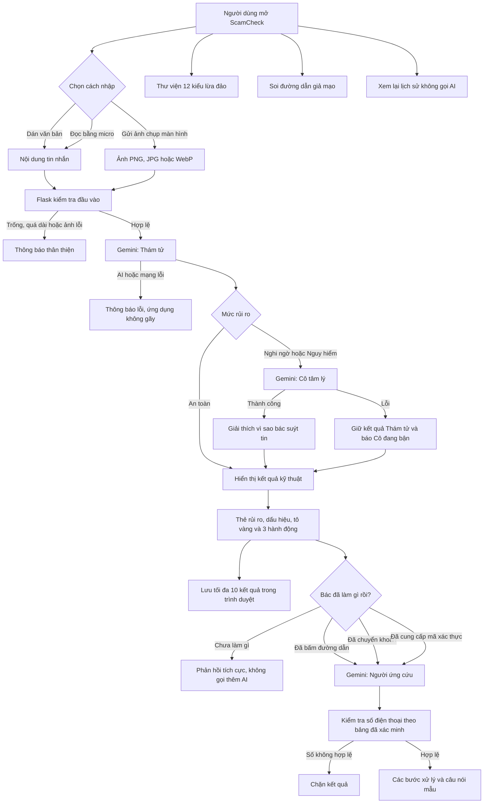

# ScamCheck

ScamCheck là ứng dụng web Flask giúp người dùng từ 45 tuổi trở lên kiểm tra tin nhắn hoặc ảnh chụp màn hình đáng ngờ. Trong một luồng, ứng dụng hiển thị mức rủi ro, dấu hiệu có trích dẫn, đúng ba hành động, giải thích tâm lý và hướng dẫn ứng cứu.

## Sơ đồ nhánh hoạt động



## Chạy trên máy

```powershell
cd C:\Users\ADMIN\scamcheck_fct
python -m venv .venv
.venv\Scripts\Activate.ps1
pip install -r requirements.txt
Copy-Item .env.example .env
```

Điền khóa mentor cấp vào `.env`, rồi chạy:

```powershell
python app.py
```

Mở `http://127.0.0.1:5000`. Khóa chỉ nằm ở backend, `.env` đã bị loại khỏi Git.

## Hạng mục đã triển khai

- Cấp 1: nhập chữ/giọng nói/ảnh chụp màn hình, Gemini đa phương thức qua backend, cảnh báo pháp lý, cấu hình triển khai bằng `Procfile`.
- Cấp 2: Thám tử trả JSON cố định, đọc dữ liệu có dự phòng, thẻ ba mức rủi ro, tô đoạn trích, đúng ba hành động, ba tin mẫu, màn hình chờ, năm lỗi biên, lịch sử tối đa 10 tin, giao diện chữ 18px.
- Cấp 3: Cô tâm lý được gọi tuần tự chỉ cho tin Nghi ngờ/Nguy hiểm; lỗi riêng không làm mất kết quả Thám tử.
- Cấp 4: chọn A — thư viện 12 kiểu lừa đảo có bộ lọc; B — tách và cảnh báo đường dẫn giả mạo bằng quy tắc cục bộ.
- Cấp 5: bốn lựa chọn tình huống, khóa sau khi chọn, không gọi AI khi chưa làm gì, Người ứng cứu có bước và câu nói mẫu, chặn số điện thoại ngoài bảng đã xác minh.
- N7: README, sơ đồ kiến trúc, 9 slide, kịch bản demo và mẫu thu thập minh chứng.

## Kiểm thử

```powershell
python -m unittest discover -s tests -v
```

Kiểm thử tự động bao phủ dữ liệu AI sai định dạng, đúng ba hành động, năm mẫu tên miền giả, tin trống, tin quá dài và bốn lựa chọn ứng cứu. Kiểm thử Gemini thật, Chrome và Safari iPhone vẫn phải thực hiện thủ công vì cần mạng, khóa và thiết bị.

## Phần cần dữ liệu hoặc tài khoản ngoài hai tài liệu

Hai file nguồn không cung cấp số hotline chính thức, khóa Gemini, tài khoản triển khai, tên thành viên, bộ 15 tin chung, ảnh phản hồi AI hay video. Vì vậy:

- `data/hotlines.json` có đủ 12 ô bắt buộc nhưng tất cả để `verified: false`; backend không truyền chúng cho AI và chặn số AI tự sinh. Chỉ đổi sang `true` sau khi xác minh từ nguồn chính thức.
- Việc xuất bản web, kiểm tra iPhone thật, thu ba ảnh Gemini và quay video phải làm với tài khoản/thiết bị của nhóm.
- Thành viên nhóm: **chưa được cung cấp trong hai tài liệu**.

Không điền số điện thoại theo trí nhớ. Sai số trong tình huống khẩn cấp nguy hiểm hơn việc để trống.

## Triển khai

Đưa kho mã lên nền tảng hỗ trợ Flask, đặt lệnh build `pip install -r requirements.txt`, lệnh start `gunicorn app:app`, rồi khai báo bí mật `GEMINI_API_KEY` và `GEMINI_MODEL`. Không commit `.env`.

> ScamCheck là công cụ giáo dục do nhóm học viên phát triển và không thay thế cảnh báo chính thức từ ngân hàng hoặc cơ quan chức năng. Khi nghi ngờ, hãy gọi tổng đài chính thức của ngân hàng được in trên thẻ.
